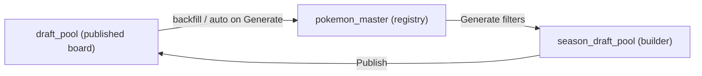

# Session changelog — 19 May 2026

Operator and engineering notes for work completed in this session. Use this as the index for related docs and code paths.

---

## Summary

| Area | Outcome |
|------|---------|
| **Google Sheets sync** | Data tab parser (24 teams), sheet policy guards, admin UI (Sync Now, select recommended) |
| **Draft pool builder** | In-app `pokemon_master` backfill; auto-run on Generate; game code documented |
| **Homepage** | Draft countdown banner under nav; admin countdown tab |
| **Coach / AI** | Claim team, release coach, OpenClaw HTTP chat path (prior commits on `main`) |
| **Local DB** | Migration repair workflow for orphan `schema_migrations` versions |
| **Cache** | Skip Upstash KV when host is Vercel-internal (local dev noise) |

---

## Google Sheets → Supabase (teams)

### Problem

- After `supabase db reset`, `teams` was empty until sync ran.
- **Select all** enabled every sheet mapped to `teams`, causing hundreds of `division` / `conference` NOT NULL errors (Team 1–12, Rules, Pokédex, etc.).
- **Sync Now** was hidden unless config was saved and at least one sheet was enabled.
- **Data** tab sync worked when enabled; other sheets did not.

### Solution

| Change | Location |
|--------|----------|
| Index-based **Data** tab parser (fixed columns for wide sheet) | `lib/google-sheets-data-tab.ts` |
| Skip non-standings sheets for `teams` sync | `lib/google-sheets-sheet-policy.ts` |
| `division` / `conference` default `TBD` on generic upsert path | `lib/google-sheets-sheet-policy.ts`, `lib/google-sheets-sync.ts` |
| AI structured output Zod fix (`.nullable()` not `.optional()`) | `lib/ai-sheet-parser.ts` |
| Detect: **Data** → `teams`; block Team N, Rules, Pokédex, etc. | `app/api/admin/google-sheets/detect/route.ts` |
| Admin UI: **Select recommended** (Data only), **Sync Now** always visible | `app/admin/google-sheets/page.tsx` |
| Merge saved mappings into sheet list without re-detect | `app/admin/google-sheets/page.tsx` |

### Operator workflow (teams)

1. Admin → **Google Sheets** — paste spreadsheet URL, **Save configuration**.
2. **Select recommended** (or enable only **Data**).
3. **Sync Now** — expect ~24 teams from Data tab.
4. Do **not** enable Team 1–12, Rules, Pokédex, MVP, Backend Data for `teams`.

See [GOOGLE-SHEETS-SYNC-GUIDE.md](./GOOGLE-SHEETS-SYNC-GUIDE.md).

---

## Draft pool & `pokemon_master`

### Problem

Generate showed: *Added 0 — pokemon_master is empty. Run scripts/backfill-pokemon-master.ts*.

### Solution

| Change | Location |
|--------|----------|
| Shared backfill logic | `lib/pokemon-master-backfill.ts` |
| `GET` / `POST` `/api/admin/pokemon-master/backfill` | `app/api/admin/pokemon-master/backfill/route.ts` |
| Auto-backfill when master empty on Generate | `lib/draft-pool-ops.ts` |
| Registry status + **Populate registry from draft board** | `app/admin/draft-pool-rules/page.tsx` |
| CLI script delegates to lib | `scripts/backfill-pokemon-master.ts` |

### Data flow



### Game code field

- Optional filter: only species with a row in `pokemon_games` for that code (e.g. `SV`).
- **Leave empty** unless `pokemon_games` is populated; otherwise Generate returns 0 matches.
- Documented on Draft Pool Rules page and in [DRAFT-IN-APP-OPERATIONS.md](./DRAFT-IN-APP-OPERATIONS.md).

---

## Homepage draft countdown

| Change | Location |
|--------|----------|
| Chicago TZ countdown from `league_config` / season | `lib/league-countdown.ts` |
| Banner under nav on `/` only | `components/homepage-countdown.tsx`, `components/conditional-header.tsx` |
| Admin **League → Countdown** tab | `components/admin/league/league-countdown-tab.tsx` |
| Season 7 draft default migration | `supabase/migrations/20260520190000_season_7_draft_countdown.sql` |
| API for homepage | `app/api/homepage/next-event/route.ts` |

---

## Coach claim & OpenClaw (shipped earlier on `main`)

| Feature | Notes |
|---------|--------|
| Claim team | `POST /api/coach/claim-team`, dashboard `/dashboard/claim-team` |
| Release coach | `POST /api/coach/release-team` |
| OpenClaw in-app chat | HTTP completions fallback `lib/openclaw/http-chat.ts`, `GET /api/openclaw/health` |

---

## Local development notes

### Supabase migration repair

If `supabase migration up` fails with a version in DB but no file in repo:

```bash
supabase migration repair --local --status reverted <orphan_version>
supabase migration up --local
```

### Redis / KV local noise

`lib/cache/redis.ts` skips KV when `UPSTASH_REDIS_REST_URL` points at `internal-*.upstash.io` (Vercel-only host).

---

## Git references

Recent commits on `main` (representative):

- `706eda84` — Google Sheets sync guards and admin UI
- `80231a67` — Countdown banner, local KV skip
- `5dd030f8` — Data tab team sync, countdown admin
- `830ca93e` / `7a662742` — OpenClaw HTTP, claim team

---

## Related documentation

| Doc | Purpose |
|-----|---------|
| [GOOGLE-SHEETS-SYNC-GUIDE.md](./GOOGLE-SHEETS-SYNC-GUIDE.md) | Sheets operator guide |
| [DRAFT-IN-APP-OPERATIONS.md](./DRAFT-IN-APP-OPERATIONS.md) | Draft pool generate / publish |
| [DATA-PIPELINE-RUNBOOK.md](./DATA-PIPELINE-RUNBOOK.md) | Teams + catalog data sources |
| [SUPABASE-DB-RESET-TROUBLESHOOTING.md](./SUPABASE-DB-RESET-TROUBLESHOOTING.md) | Reset + re-sync |
| [ADMIN-CONFIG-QUICK-REFERENCE.md](./ADMIN-CONFIG-QUICK-REFERENCE.md) | Admin routes index |
