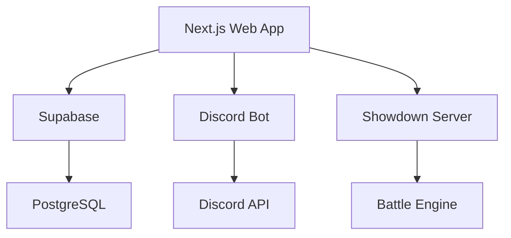

# README Image Enhancement Guide

**Date**: January 17, 2026  
**Purpose**: Strategies for enhancing README.md with visual elements

---

## Current Assets Available

### Logo & Branding
- `public/league-logo.png` - PNG version (larger file size)
- `public/league-logo.svg` - SVG version (recommended for README)
- `public/pokeball-normal.svg` - Pokeball icon
- `public/pokeball-master.svg` - Master ball icon
- `public/pokeball-ultra.svg` - Ultra ball icon
- `public/gym-leader-badge.webp` - Gym leader badge image

### Background Images
- `public/league-bg-dark.png` - Dark mode background
- `public/league-bg-light.png` - Light mode background

---

## Image Integration Strategies

### 1. Header Logo (✅ Already Implemented)

**Current Implementation**:
```markdown
<div align="center">


# POKE MNKY
```

**Enhancement Options**:
- Add a hero banner image below the logo
- Include a tagline with the logo
- Add animated Pokeball icons flanking the logo

**Example Enhancement**:
```markdown
<div align="center">


<div>
  
  <h1>POKE MNKY</h1>
  
</div>

**Transform traditional Discord-based Pokémon draft leagues into a modern, feature-rich web platform**

</div>
```

### 2. Architecture Diagram Enhancement

**Current**: ASCII art diagram  
**Enhancement**: Use Mermaid diagrams or screenshots

**Option A: Mermaid Diagram**
```markdown

```

**Option B: Screenshot**
- Take a screenshot of the actual architecture from documentation
- Use tools like [diagrams.net](https://app.diagrams.net/) to create visual diagrams
- Export as PNG/SVG and include in README

### 3. Feature Showcase Section

**Add Screenshots of Key Features**:

```markdown
## ✨ Features Showcase

### League Management

*Real-time standings with divisional breakdowns*

### Battle System

*Showdown-accurate battle simulation*

### AI-Powered Insights

*GPT-5.2 powered strategic analysis*

### Discord Integration

*Seamless Discord workflow integration*
```

**Screenshot Recommendations**:
1. **Homepage Hero** - Show the landing page with stats
2. **Standings Page** - Display league standings table
3. **Team Builder** - Show team composition interface
4. **Battle Lobby** - Showdown integration screenshot
5. **Admin Dashboard** - Platform management interface
6. **Discord Bot** - Slash commands in action
7. **Pokédex** - AI assistant interface

### 4. Technology Stack Badges

**Current**: Text badges  
**Enhancement**: Add technology logos

```markdown
## 🛠️ Technology Stack

<div align="center">


</div>
```

### 5. Status Indicators with Icons

**Enhancement**: Add visual status indicators

```markdown
### Current Status

| Component | Status | Completion |
|-----------|--------|------------|
| **Server Infrastructure** | ✅ Operational | 90% |
| **Next.js Application** | ✅ Production-ready | 95% |
| **Database Schema** | ✅ Complete | 100% |
| **AI Features** | ✅ Complete | 100% |
| **Discord Integration** | ⚠️ Testing Pending | 85% |
| **Battle Engine** | ⚠️ Framework Complete | 70% |
| **Automation** | ⚠️ In Progress | 40% |
```

**Visual Enhancements**:
- Use progress bars: `████████░░ 90%`
- Add emoji indicators: ✅ ⚠️ ❌ 🔄
- Include color-coded badges

### 6. Quick Start Visual Guide

**Add Visual Steps**:

```markdown
## 🚀 Quick Start

### Step 1: Clone Repository
```bash
git clone https://github.com/your-org/poke-mnky-v2.git
cd poke-mnky-v2
```


### Step 2: Install Dependencies
```bash
pnpm install
```


### Step 3: Configure Environment

```

### 7. Project Statistics Visualization

**Current**: Text list  
**Enhancement**: Visual cards or charts

```markdown
## 📊 Project Statistics

<div align="center">

| Metric | Value |
|--------|-------|
| 🐳 Docker Services | 12 |
| 📝 Database Migrations | 48 |
| 🛣️ API Routes | 50+ |
| 📄 Pages | 30+ |
| 🧩 UI Components | 90+ |
| 💾 Cache Hit Rate | 98% |

</div>
```

**Alternative**: Use shields.io for dynamic badges:
```markdown


```

### 8. Screenshot Creation Workflow

**Recommended Tools**:
1. **Browser Extensions**:
   - [Fireshot](https://www.getfireshot.com/) - Full page screenshots
   - [Awesome Screenshot](https://www.awesomescreenshot.com/) - Annotated screenshots
   - [Nimbus Screenshot](https://nimbusweb.me/screenshot.php) - Screen recording

2. **Design Tools**:
   - [Figma](https://www.figma.com/) - Create mockups and diagrams
   - [Canva](https://www.canva.com/) - Quick graphics and banners
   - [Excalidraw](https://excalidraw.com/) - Hand-drawn style diagrams

3. **Screenshot Storage**:
   - Create `docs/screenshots/` directory
   - Use descriptive filenames: `standings-page.png`, `battle-interface.png`
   - Optimize images (use tools like [TinyPNG](https://tinypng.com/))

**Screenshot Checklist**:
- [ ] Homepage hero section
- [ ] Standings page
- [ ] Team builder interface
- [ ] Battle lobby/Showdown integration
- [ ] Admin dashboard
- [ ] Discord bot commands
- [ ] Pokédex with AI assistant
- [ ] Mobile responsive views
- [ ] Dark mode screenshots

### 9. Animated GIFs (Advanced)

**For Complex Interactions**:
- Record screen interactions using [LICEcap](https://www.cockos.com/licecap/) or [Kap](https://getkap.co/)
- Show battle flow, team building process, Discord command usage
- Keep GIFs under 5MB for GitHub rendering

**Example**:
```markdown
### Battle Flow

*Complete battle flow from lobby to result submission*
```

### 10. Logo Variations

**Use Different Logo Sizes**:
- Small: `width="32" height="32"` for badges
- Medium: `width="64" height="64"` for headers
- Large: `width="128" height="128"` for hero sections

**Example**:
```markdown
<div align="center">


# POKE MNKY

</div>
```

---

## Implementation Priority

### Phase 1: Quick Wins (Immediate)
1. ✅ Add logo to header (already done)
2. Add technology stack badges with logos
3. Enhance status table with progress bars
4. Add Pokeball icons to feature sections

### Phase 2: Screenshots (Week 1)
1. Take screenshots of key pages
2. Create `docs/screenshots/` directory
3. Add feature showcase section
4. Optimize images for web

### Phase 3: Advanced Visuals (Week 2-3)
1. Create architecture diagram (Mermaid or visual)
2. Add animated GIFs for complex interactions
3. Create visual quick start guide
4. Add project statistics visualization

---

## Best Practices

1. **Image Optimization**:
   - Use SVG for logos and icons (scalable, small file size)
   - Compress PNG/JPG screenshots (aim for <500KB each)
   - Use WebP format when possible (better compression)

2. **Accessibility**:
   - Always include `alt` text for images
   - Use descriptive filenames
   - Ensure images are readable in both light and dark modes

3. **GitHub Rendering**:
   - GitHub caches images, so updates may take time
   - Use relative paths for images in repository
   - Avoid external image hosting (can break)

4. **Mobile Considerations**:
   - Ensure images scale well on mobile
   - Test README rendering on GitHub mobile app
   - Keep image widths reasonable (max 1200px)

5. **Consistency**:
   - Use consistent image sizes throughout
   - Maintain visual style across all screenshots
   - Use same color scheme as application

---

## Tools & Resources

- **Badge Generator**: [shields.io](https://shields.io/)
- **Diagram Tools**: [Mermaid](https://mermaid.js.org/), [diagrams.net](https://app.diagrams.net/)
- **Image Optimization**: [TinyPNG](https://tinypng.com/), [Squoosh](https://squoosh.app/)
- **Screenshot Tools**: Fireshot, Awesome Screenshot, Nimbus Screenshot
- **GIF Creation**: LICEcap, Kap, [GIPHY Capture](https://giphy.com/apps/giphycapture)

---

## Next Steps

1. **Immediate**: Enhance current README with logo and badges
2. **This Week**: Take screenshots of key features
3. **Next Week**: Create visual architecture diagram
4. **Future**: Add animated GIFs and interactive elements

---

**Note**: All screenshots should be stored in `docs/screenshots/` directory and referenced using relative paths in the README.
